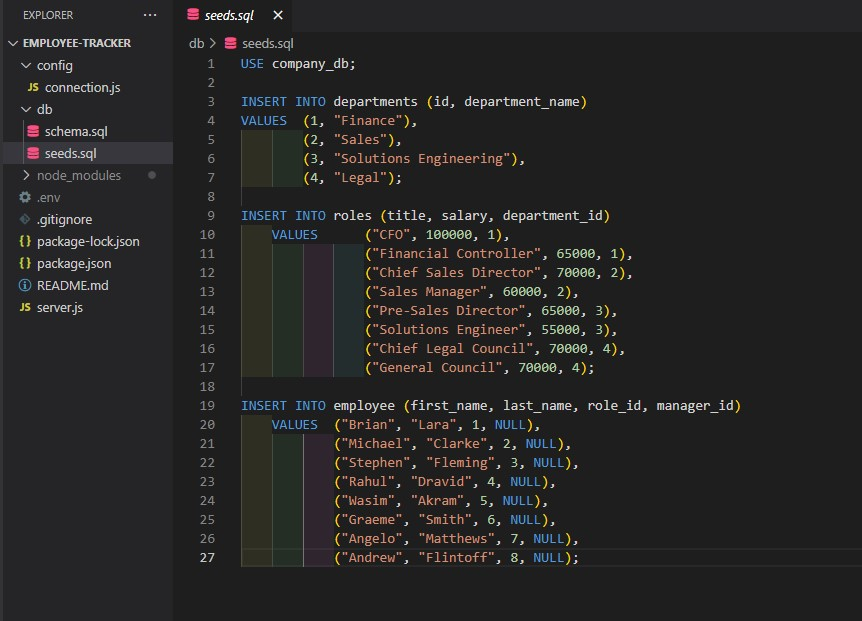

# Employee-Tracker
Node based application for tracking employees within an organisation

## Description
This week, we built an application that makes it easier to track employees within our company. The application draws from data listed in our seeds.db files and publishes them in the node terminal.

## Technologies used

Node Terminal
Javascript
MySQL

### Dependencies

MySQL
Inquirer
console table

## Functionality

GIVEN a command-line application that accepts user input
WHEN I start the application
THEN I am presented with the following options: view all departments, view all roles, view all employees, add a department, add a role, add an employee, and update an employee role
WHEN I choose to view all departments
THEN I am presented with a formatted table showing department names and department ids
WHEN I choose to view all roles
THEN I am presented with the job title, role id, the department that role belongs to, and the salary for that role
WHEN I choose to view all employees
THEN I am presented with a formatted table showing employee data, including employee ids, first names, last names, job titles, departments, salaries, and managers that the employees report to
WHEN I choose to add a department
THEN I am prompted to enter the name of the department and that department is added to the database
WHEN I choose to add a role
THEN I am prompted to enter the name, salary, and department for the role and that role is added to the database
WHEN I choose to add an employee
THEN I am prompted to enter the employee’s first name, last name, role, and manager, and that employee is added to the database

## Access

You can find this application's repo via this link below:

https://github.com/oscarcbryant/Employee-Tracker

You can watch this applications video walkthrough via this link below:

## Contributors
https://github.com/oscarcbryant

Anyone else can contribute to this code
